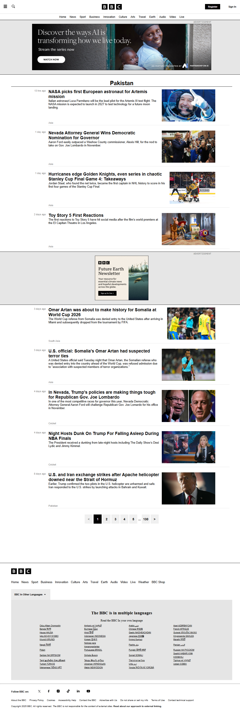

# BBC News homepage clone with live news integration

A desktop-focused clone of the **BBC News homepage** built using vanilla HTML, CSS, and JavaScript. The project recreates the overall structure and visual layout of BBC News while integrating live news content through the GNews API.


## Project Preview

This project includes:

- **BBC-inspired navigation and layout**
- Dynamic news articles fetched from an external API
- Advertisement sections
- Pagination interface
- Multi-language footer section
- Interactive language toggle
- Desktop-first design

## Live Demo

Click the preview image below to visit the live demo:

[](https://hadiashah01.github.io/bbc-news-homepage-clone/)

> [!NOTE]  
> This project is intentionally designed as a desktop-focused clone. It does not include responsive breakpoints or mobile-specific layouts.


## Live News Integration

Unlike a fully static clone, this project fetches real-time news articles using the GNews API.

JavaScript dynamically updates:

- Headlines
- Article descriptions
- News images

This allows the page content to change automatically whenever new articles are retrieved from the API.


## Technologies Used


- **HTML5**
- **CSS3**
- **JavaScript (ES6)**
- **Fetch API**
- **GNews API**


## Project Structure

```bash
├── index.html
├── style.css
├── script.js
└── README.md
└── images
```

## Features

- **Desktop-only BBC-style layout**
- **Dynamic news content**
- **API integration**
- **DOM manipulation**
- **Language section toggle**
- **Flexbox-based architecture**
- **Semantic HTML structure**


## Setup & Local Execution

Clone the repository:

```bash
git clone https://github.com/your-username/bbc-news-homepage-clone.git
```

Navigate into the project folder:

```bash
cd bbc-news-homepage-clone
```

Open index.html in any modern web browser.


## Disclaimer

This project was built for educational and portfolio purposes only. BBC logos, branding, and content belong to their respective owners. This project is not affiliated with or endorsed by BBC.


## Author

**Hadia Shahjahan**